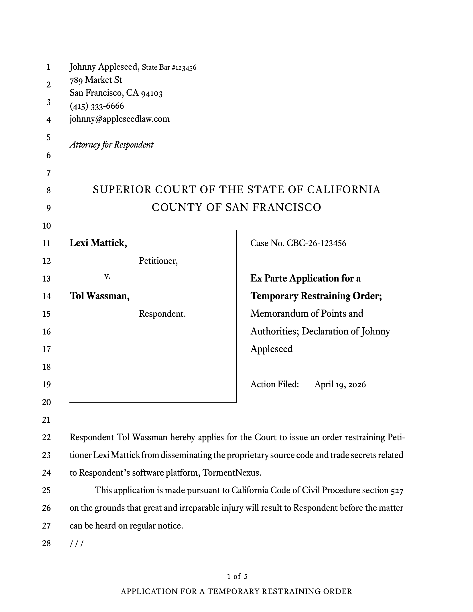

# Golden Pleading

A Typst library and template for legal pleading paper in California courts.

Designed to look good while following the California Rules of Court pertaining to formatting, line numbers, footers, exhibits, and even a subset of the requirements for e-filed documents.

> [!WARNING]
> I provide no guarantee that this template actually follows any rule, guideline, or regulation. My distribution of this template does not in any way constitute legal advice, nor does any of the template's documentation. You are entirely responsible for anything you make or file using the template. Any legal text used to demonstrate the template is only for illustration.



## Basic Usage

Apply the template to your document with a `show` rule:

```typst
#import "@local/golden-pleading:0.1.0": *

#show: pleading.with(
  contact-info: [
    Alice Rodriguez\
    123 Beale St\
    San Francisco, CA 94107\
    (415) 123-4567\
    alice\@example.com\
    \
    _In Pro Per_
  ],
  county: "San Francisco",
  caption: [
    #party[Alice Rodriguez,] #role[Plaintiff,]
    #versus
    #party[Bob Smith,] #role[Defendant.]
  ],
  case-number: "CBC-26-123456",
  short-title: "Motion to Compel to Produce Financial Records",
  long-title: "Motion to Compel Defendant to Produce Financial Records at Trial"
)
```

A further fleshed out example is provided in `template/main.typ`, and docuentation of specific options is available below.

## Configuring the Caption Page

### Contact Info


In the `contact-info` block, you can use `#sbn` to specify attorneys' bar numbers:

```typst
contact-info: [
  Johnny Appleseed, #sbn[123456]\
  ...
],
```

I recommend italicizing indicators like "Attorneys for Plaintiff" or "In Pro Per" but not any client name:

```typst
contact-info: [
  Johnny Appleseed, #sbn[123456]\
  ...
  \
  _Attorney for Petitioner_\
  Lexi Mattick
],
```

### Court Name


The name of the court appears at line 8, which is guaranteed at compile time to be below 3 1/3 inches from the top of the page per California Rules of Court, rule 2.111.

By default, the template assumes a California Superior Court with the county specified in the `county` option:

```typst
county: "Los Angeles",
```

If you want, you can specify your own text, which will be automatically capitalized:

```typst
court: [
  Superior Court of the State of California\
  County of Los Angeles
],
```

### Caption Block


The long caption block of the case is specified in the `caption` option.

The following utilities are available for formatting this block:

- `#party[John Doe]`: name of a party in the case.
- `#role[Role]`: role of the party, will be indented on a new line.
- `#versus`: standard "v." line with improved vertical alignment.

Example with a more complex case block:

```typst
caption: [
  #party[Lexi Mattick,] #role[Petitioner,]
  #versus
  #party[Tol Wassman,] #role[Respondent,]
  \
  #party[Example Person], an individual,
  and #party[Another Example], an individual,
  #role[Intervenors.]
],
```

### Title Section


Required options are `case-number` and `long-title`. The `short-title` will be displayed in the footer and set as the PDF document's title.

If other documents than the titled document are attached, use `additional-documents` instead of using semicolons in the `long-title`. This way, they will be formatted in a way that is more readable:

```typst
additional-documents: (
  "Memorandum of Points and Authorities", 
  "Declaration of Johnny Appleseed"
),
```

You can pass additional options that will be added to the table below the title. I recommend specifying as many as are known in the case:

- `department`: number. Department number for the case.
- `judge`: string. Name of the case's judge, honorific will be added.
- `action-filed`: datetime. Date the original action was filed.
- `trial`: datetime. Date of a trial, if there will be one.
- `hearing`: datetime. Date *and time* of a scheduled hearing.

Finally, you can specify `bonus-info` that will appear at the bottom of the block, for example:

```typst
bonus-info: [Limited Civil Suit],
```

## Headings


Top-level (`=`) headings will be centered, capitalized, and placed on a new page. These are apt for the beginning of a section like a Memorandum of Points and Authorities.

### Third-Level Headings

I recommend that you indent third-level headings and the text underneath them. Due to limitations in Typst, the template can't do this automatically, but you can use the `#indent` utility:

```typst
== Heading 2

This is some text.

#indent[
    === Heading 3

    This text and the above heading will be indented.
]
```

### Disabling Numbering

By default, all headings of `==` level and below will be numbered heirarchically.

To disable this:

```typst
#set heading(numbering: none)
```

To re-enable it:

```typst
#set heading(numbering: point-numbering)
```

## Utilities

### Signature Blocks


Adds a signature block. By default, the date will be a blank line, useful for proposed orders.

Usage:

```typst
#signature[
  John Smith
]
```

To display a specific date:

```typst
#signature(date: datetime(year: 2026, month: 6, day: 4))[
  John Smith
]
```

### Continuation


Typst will often leave blank lines at the bottom of pages to avoid [widows and orphans](https://en.wikipedia.org/wiki/Widows_and_orphans). However, this can look unaesthetic and also leave it unclear that there is more text to follow on the next page.

After your document is completely drafted, I recommend inserting `#continuation` anywhere you notice these blank lines plaguing your document. This will automatically calculate the number of triple-slash continuation marks needed to fill to the bottom of the page.

Place it at the end of the last line of the page, even if this is in the middle of a paragraph.

See the demo file in `template/main.typ` for an example of this in action.

### Disable Hyphenation

Surround a word or part of a word with `#nobr` and that text won't be able to be broken with hyphens. Useful for when hyphenation is behaving differently how from how you would like.

```typst
This word will wrap instead of breaking:
#nobr[supercalifragilisticexpialidocious]
```

### Indent

Indents the provided content with the standard indentation.

```typst
#[
    This text will be indented!
]
```

## Exhibits

Golden Pleading has first-class support for exhibits, including an index of exhibits and automatic citations.

### Index of Exhibits


Just place `#index-of-exhibits` in the document where you want your Index of Exhibits to be. This will probably be right before all of your exhibits.

Each entry in the index of exhibits is clickable and jumps to the first page of the exhibit past the cover page.

### Inserting Exhibits


To insert an exhibit itself, use the `#exhibit` function.

To comply with California Rules of Court on e-filing documents with exhibits, this also inserts a bookmark in the PDF to the first page of the exhibit after the cover page. The title of the bookmark will include the exhibit letter and the description of the exhibit.

Due to a limitation of Typst, if your exhibit is a PDF with multiple pages, you will have to manually list every page like this:

```typst
#exhibit(
  letter: "A",
  description: [This is a description of Exhibit A.],
  image("Exhibit A.pdf", page: 1),
  image("Exhibit A.pdf", page: 2),
)
```

### Citations


Use `#cite-exhibit` to insert a clickable link to the name of the link with an automatically generated page number.

Supports two citations formats:

- Short (default): "Ex. A, p. 19"
- Long: "Exhibit A, page 19"

Basic usage:

```
#cite-exhibit("A")
```

To use the long citation format:

```typst
#cite-exhibit("A", long: true)
```

To cite a different page of the exhibit:

```typst
#cite-exhibit("A", page: 3)
```

## Using Other Fonts

Font presets can be specified with the `font-settings` option.

I actually quite like Typst's default font, Libertinus Serif. Therefore, the default preset is `libertinus-serif`.

If you own [Equity](https://typographyforlawyers.com/equity.html), Matthew Butterick's excellent font designed for legal writing, this template also comes with built-in presets, `equity-ot-a` and `equity-ot-b`. Ensure you have the Equity OT font files installed.

Example using Equity A:

```typst
font-settings: equity-ot-a,
```

You can also specify your own font settings:

```typst
font-settings: (
  // Font family name.
  family: "Libertinus Serif",

  // Whether the small caps OpenType feature adds letter spacing.
  has-small-caps-tracking: false,

  // Font size of continuation slashes.
  continuation-size: 12pt,

  // Font size of large titles.
  lg-size: 15pt,
)
```

## Constants for Developers

If you're doing heavily customized layouts, the following variables are available:

- `page-size`: the size of the page in the form of `(width, height)`.
- `margins`: the page margins in the form of `(x, top, bottom)`.
- `line-height`: the distance between the top of one line and the top of the next line.
- `line-gap`: the space from the baseline of a line of text to the top of the next line.
- `indentation`: the standard indentation size.